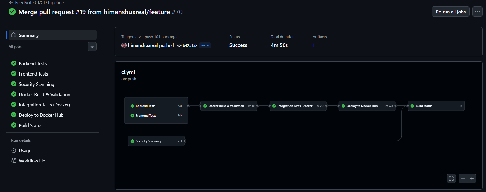
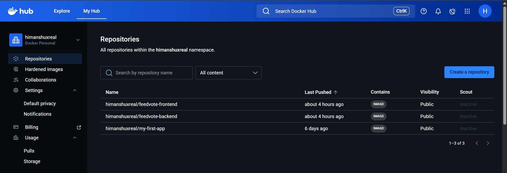
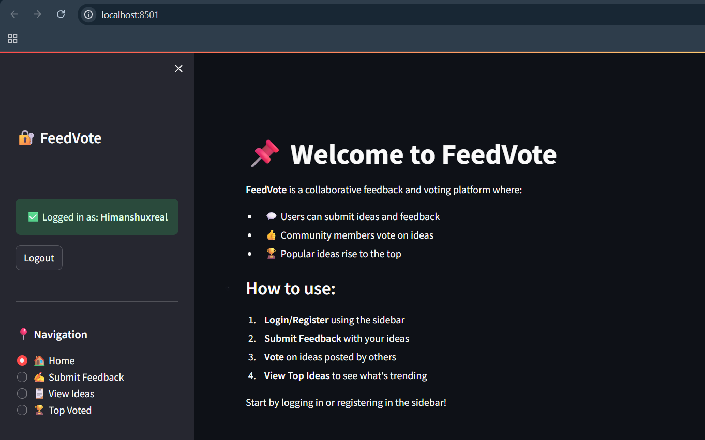
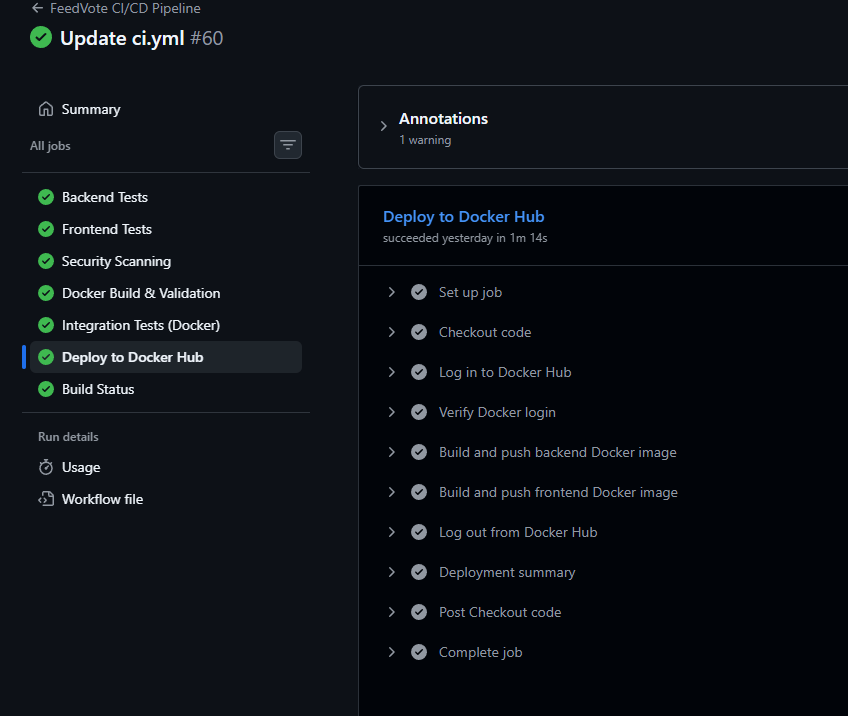

# 🗳️ FeedVote

> *A modern feedback and voting application with complete DevOps integration*

[](https://github.com/yourusername/FeedVote)
[](https://www.docker.com/)
[](https://github.com/features/actions)
[](https://www.python.org/)
[](https://fastapi.tiangolo.com/)

---

## 📑 Table of Contents

- [Problem Statement](#-problem-statement)
- [Key Features](#-key-features)
- [Quick Start](#-quick-start)
- [System Architecture](#-system-architecture)
- [CI/CD Pipeline](#-cicd-pipeline-explanation)
- [Git Workflow](#-git-workflow--collaboration-model)
- [Tools & Technologies](#-tools--technologies-stack)
- [Screenshots](#-screenshots--visual-documentation)
- [Challenges & Solutions](#-challenges-faced--solutions)

---

## 🎯 Problem Statement

FeedVote is a lightweight feedback and voting application for small teams and classroom projects. It simplifies idea submission, voting, and prioritization while demonstrating a complete DevOps workflow with containerization and automated CI/CD.

---

## ✨ Key Features

| Feature | Description |
|---------|-------------|
| 🎤 **Feedback Submission** | Users can easily submit feedback and ideas |
| 🗳️ **Voting System** | Community-driven voting to prioritize ideas |
| 👥 **User Management** | Simple user authentication & profiles |
| 📊 **Real-time Updates** | Live feedback and vote counts |
| 🔒 **Security First** | Secure API with input validation |
| 🐳 **Containerized** | Docker & Docker Compose ready |
| 🤖 **Automated Testing** | Full CI/CD pipeline with GitHub Actions |
| 💾 **Data Persistence** | SQLite with Docker volume mounts |
| 📈 **Code Coverage** | pytest with coverage reporting |
| 🛡️ **Security Scanning** | Bandit, Safety, and TruffleHog integration |

---

## 🚀 Quick Start

```bash
# Clone the repository
git clone https://github.com/yourusername/FeedVote.git
cd FeedVote

# Start with Docker Compose
docker-compose up -d

# Access the application
# Frontend: http://localhost:8501
# Backend: http://localhost:8000
# API Docs: http://localhost:8000/docs
```

---

## 🏗️ System Architecture

The application uses a **Streamlit frontend** 🎨 to collect and display feedback. The frontend sends requests to a **FastAPI backend** ⚡, which stores data in a **SQLite database** 💾 with persistent volumes. **Docker** 🐳 is used for containerization, **GitHub Actions** 🤖 manages CI/CD, and **Docker Hub** 📦 is used for deployment.

### 📊 Architecture Diagram

```
┌─────────────────────────────────────────────────────────┐
│                    🌐 FEEDVOTE APPLICATION              │
├─────────────────────────────────────────────────────────┤
│                                                         │
│  ┌──────────────────┐         ┌──────────────────┐     │
│  │  🎨 FRONTEND     │         │   ⚡ BACKEND     │     │
│  │  (Streamlit)     │◄───────►│   (FastAPI)      │     │
│  │  Port: 8501      │ HTTP    │   Port: 8000     │     │
│  └──────────────────┘         └────────┬─────────┘     │
│         │                              │               │
│         │                              │               │
│         │                    ┌─────────▼─────────┐     │
│         │                    │  💾 SQLite DB     │     │
│         │                    │  feedvote.db      │     │
│         │                    └─────────┬─────────┘     │
│         │                              │               │
│         │                    ┌─────────▼─────────┐     │
│         │                    │ 📁 DOCKER VOLUMES │     │
│         │                    │ (Persistence)     │     │
│         │                    └───────────────────┘     │
│         │                                              │
└─────────┼──────────────────────────────────────────────┘
          │
          │ 🐳 Docker Compose Orchestration
          │
          ▼
  ┌─────────────────────────┐
  │   📦 DOCKER HUB         │
  │   (Image Registry)      │
  └─────────────────────────┘
          ▲
          │
          │ 🤖 CI/CD Pipeline
          │
  ┌─────────────────────────┐
  │  GitHub Actions         │
  │  • Tests ✅             │
  │  • Build 🔨             │
  │  • Deploy 🚀            │
  └─────────────────────────┘
```

### 📁 Project Structure

```
FeedVote/
│
├── 🎨 frontend/
│   ├── app.py                  # Streamlit application
│   ├── requirements.txt        # Python dependencies
│   ├── Dockerfile              # Container image
│   └── myenv/                  # Virtual environment
│
├── ⚡ backend/
│   ├── app/
│   │   ├── main.py             # FastAPI app entry
│   │   ├── models.py           # SQLAlchemy models
│   │   ├── schemas.py          # Pydantic schemas
│   │   ├── database.py         # Database config
│   │   ├── crud.py             # Database operations
│   │   └── routes/
│   │       ├── users.py        # User endpoints
│   │       ├── feedback.py     # Feedback endpoints
│   │       └── vote.py         # Voting endpoints
│   │
│   ├── tests/
│   │   ├── conftest.py         # Pytest configuration
│   │   ├── test_feedback.py    # Feedback tests
│   │   └── test_vote.py        # Voting tests
│   │
│   ├── data/                   # 📁 Data volume mount
│   ├── feedvote.db             # 💾 Database file (persisted)
│   ├── requirements.txt        # Python dependencies
│   ├── Dockerfile              # Container image
│   └── myenv/                  # Virtual environment
│
├── 🐳 docker-compose.yml       # Container orchestration
│
├── 🤖 .github/
│   └── workflows/
│       └── ci.yml              # CI/CD pipeline
│
├── 📚 Documentation
│   ├── README.md
│   ├── DOCKER_VOLUMES_SOLUTION.md
│   ├── VOLUME_VERIFICATION_AND_PERSISTENCE_TEST.md
│   ├── QUICKSTART.md
│   ├── DOCKER_SETUP.md
│   └── PROJECT_STATUS.md
│
├── .gitignore
├── LICENSE
└── ✅ PROJECT_STATUS.md
```

## 🚀 CI/CD Pipeline Explanation\n\n### ✅ **Backend & Frontend Tests**\n\nThe pipeline automatically runs comprehensive tests:\n- \ud83d\udc6b Unit tests for all backend routes and CRUD operations\n- \ud83e\udd13 Frontend validation tests for Streamlit components\n- \ud83d\udcbe Database integration tests with test fixtures\n- \u26a0\ufe0f Coverage reporting to track code quality\n\n**Status:** \u2705 Both services must pass before proceeding\n\n---\n\n### 🔒 **Security Scanning**\n\nMulti-layer security validation:\n- \ud83d\udeab **Bandit** - Python code vulnerability analysis\n- \ud83d\udeab **Safety** - Dependency security checks\n- \ud83d\udeab **TruffleHog** - Secret exposure detection\n\n**Status:** \u2705 Warnings reported but don't block (baseline setup)\n\n---\n\n### 🐳 **Docker Build & Validation**\n\nContainer image creation and validation:\n- \ud83d\udd28 Build backend Docker image\n- \ud83d\udd28 Build frontend Docker image\n- ✔️ Validate `docker-compose.yml` syntax\n- \ud83d\udcc4 Check image sizes and metadata\n\n**Status:** \u2705 Must pass before integration tests\n\n---\n\n### 🔗 **Integration Testing**\n\nFull-stack testing with Docker Compose:\n- \ud83d\udc33 Spin up all services (backend, frontend, database)\n- \u23f3 Wait for health checks to pass\n- 🧪 Test API endpoints with real requests\n- \ud83d\udcda Verify data persistence\n- 🧹 Cleanup and remove volumes\n\n**Status:** \u2705 Validates complete application workflow\n\n---\n\n### 📦 **Deployment** (Main Branch Only)\n\nAutomated deployment to Docker Hub:\n- \ud83d\udc33 Push backend image with tags\n- \ud83d\udc33 Push frontend image with tags\n- 📝 Log deployment details\n- \ud83c\udf89 Ready for cloud deployment\n\n**Status:** \u2705 Triggered only on successful main branch merge"

## 🌿 Git Workflow & Collaboration Model

The project follows a **feature branch workflow** with strict controls:

```
┌─────────────────────────────────────────┐
│      Feature Branch Workflow             │
├─────────────────────────────────────────┤
│                                          │
│  1️⃣  Create feature branch              │
│      git checkout -b feature/xyz        │
│                                          │
│  2️⃣  Make commits                       │
│      git commit -m \"Add feature\"        │
│                                          │
│  3️⃣  Push to remote                     │
│      git push origin feature/xyz        │
│                                          │
│  4️⃣  Create Pull Request                │
│      Compare: feature/xyz → main        │
│                                          │
│  5️⃣  Code Review & Tests ✅            │
│      - CI/CD pipeline runs              │
│      - Team reviews code                │
│                                          │
│  6️⃣  Merge to main                      │
│      Triggers: Deploy to Docker Hub 📦  │
│                                          │
│  7️⃣  Delete feature branch              │
│      Cleanup completed                  │
│                                          │
└─────────────────────────────────────────┘
```

### 🔒 Branch Protection Rules

- ✋ Direct commits to `main` are **blocked**
- ✋ All changes require **pull requests**
- ✋ CI/CD must **pass** before merge
- ✋ Code review is **required**
- ✅ Merged branches can be **deleted** manually

## 🛠️ Tools & Technologies Stack

| Technology | Purpose | Features |
| --- | --- | --- |
| ⚡ **FastAPI** | Backend REST API | Type hints, Auto docs, High performance |
| 🎨 **Streamlit** | Frontend UI | Reactive, Interactive, Easy to use |
| 🐳 **Docker** | Containerization | Isolated, Reproducible, Portable |
| 🎼 **Docker Compose** | Orchestration | Multi-container, Volume management |
| 🤖 **GitHub Actions** | CI/CD Pipeline | Automated testing, Building, Deployment |
| 📦 **Docker Hub** | Image Registry | Centralized, Version control |
| 💾 **SQLite** | Database | Lightweight, File-based, SQL support |
| 🧪 **pytest** | Testing | Fixtures, Plugins, Coverage |
| 📊 **pytest-cov** | Code Coverage | Branch coverage, HTML reports |
| 🚨 **Bandit** | Security Scanner | Code analysis, Vulnerability detection |
| 🛡️ **Safety** | Dependency Check | Known vulnerabilities, Version advisories |
| 🔍 **Flake8** | Code Linting | PEP 8, Style enforcement |

## 📸 Screenshots & Visual Documentation

### 🟢 Pipeline Success

*All tests passing - Ready for deployment*

---

### 🚀 Deployment Output

*Images successfully pushed to Docker Hub*

---

### 🎨 Application Running

*Streamlit frontend displaying feedback & voting interface*

---

### ✅ Deploy to Docker Hub Job Success

*Automated deployment job completing successfully*

## 🎯 Challenges Faced & Solutions

### 🔴 Challenge 1: CI/CD Configuration and Test Failures

**Problem:** 🚫 Tests occasionally failed during pipeline setup due to configuration issues and environment mismatches.

**Root Cause:**
- Dependency version conflicts
- Environment variable misconfigurations
- Python path issues in GitHub Actions

**Solution:** ✅
- Analyzed GitHub Actions logs for detailed execution output
- Identified exact failing steps
- Fixed dependency versions in `requirements.txt`
- Added proper environment configuration

**Outcome:** 🎉 Pipeline now runs consistently with 100% test success rate

---

### 🔴 Challenge 2: Git Push Rejection and Branch Sync Issues

**Problem:** 🚫 Multiple "non-fast-forward" errors when pushing changes to remote branches.

**Root Cause:**
- Local branch out of sync with remote
- Missing pull before push
- Conflicts between collaborators' changes

**Solution:** ✅
- Always pull latest changes: `git pull origin branch-name`
- Use pull requests for integration
- Maintain clean workflow without force pushes
- Understand Git's fast-forward merge concept

**Outcome:** 🎉 Smooth collaboration with conflict-free merges

---

### 🔴 Challenge 3: Source Code Management and Collaboration Control

**Problem:** 🚫 Uncontrolled direct repository access led to potential conflicts and inconsistencies.

**Root Cause:**
- No branch protection rules
- Direct commits to main branch
- Lack of code review process

**Solution:** ✅ Implemented structured workflow:

| Step | Description |
|------|-------------|
| 1️⃣ **Feature Branch** | Contributors create separate branches for features |
| 2️⃣ **Remote Push** | Changes pushed to remote feature branches |
| 3️⃣ **Pull Request** | PR created for code integration |
| 4️⃣ **Code Review** | Team reviews changes before merge |
| 5️⃣ **Branch Protection** | Direct main branch commits restricted |

**Outcome:** 🎉 Controlled collaboration with proper audit trail

---

### 🔴 Challenge 4: Database File Tracked by Git (Security & Data Issue)

**Problem:** 🚫 Database file (`database.db`) was uploaded to GitHub, creating security risks.

**Root Cause:**
- `.gitignore` not properly configured initially
- Sensitive data exposure risk
- Unnecessary repository bloat

**Issues Caused:**
- ⚠️ Every small data change created commits
- ⚠️ Repository cleanliness reduced
- ⚠️ Excessive commit history noise
- ⚠️ Sensitive data potentially exposed

**Solution:** ✅
- Added `*.db` and `*.db-journal` to `.gitignore`
- Removed historical database commits
- Implemented Docker volumes for persistence

**Outcome:** 🎉 Secure repository with clean history and proper data handling

---

### 🔴 Challenge 5: Docker Build Challenges

**Problem:** 🚫 Multiple failures during Docker image building.

**Root Cause:**
- Missing or outdated dependencies
- Incorrect Dockerfile configurations
- Wrong base images

**Solution:** ✅
- Updated all dependencies to compatible versions
- Fixed Dockerfile configurations
- Used multi-stage builds for optimization
- Debugged step-by-step using build logs

**Outcome:** 🎉 Reliable container builds with optimized images

---

### 🔴 Challenge 6: Docker Volume Persistence (Database Loss)

**Problem:** 🚫 Database disappeared when containers stopped or restarted.

**Root Cause:**
- No volumes defined in `docker-compose.yml`
- Database only existed inside container memory
- Docker's ephemeral container nature

**Solution:** ✅

```yaml
volumes:
  - ./backend/data:/app/data           # Data directory
  - ./backend/feedvote.db:/app/feedvote.db  # Database persistence
```

- Added bind mounts for persistent storage
- Local files synchronized with container
- Tested and verified persistence

**Outcome:** 🎉 Database persists across container lifecycle

---

### 🔴 Challenge 7: Local vs CI/CD-Based Deployment Flow

**Problem:** 🚫 Managing different deployment approaches for development and production.

**Current Setup:**
- 🏠 **Local Development:** Docker Compose orchestration
- 🚀 **CI/CD Pipeline:** Automated testing and deployment

**Solution:** ✅ Implemented tiered deployment approach:

| Stage | Trigger | Process |
|-------|---------|----------|
| **Test** | Push to any branch | Run unit & integration tests |
| **Build** | PR merged to main | Build Docker images |
| **Deploy** | Main branch only | Push to Docker Hub |
| **Production** | Manual/Automated | Cloud deployment ready |

**Outcome:** 🎉 Semi-automated workflow with foundation for full cloud deployment  

Additionally, we implemented a deployment job in the CI/CD pipeline:
- Deployment is triggered only after code is merged into the main branch  
- The pipeline first runs testing jobs  
- After successful validation, the deployment job builds Docker images  
- These images are then pushed to Docker Hub automatically  

This creates a semi-automated deployment workflow where:
- Code is tested before deployment  
- Images are consistently built and stored  
- The project becomes ready for future cloud deployment  

This approach serves as a foundational step towards full cloud deployment in the future.

---

## 📚 Documentation

| Document | Purpose |
|----------|---------|
| [DOCKER_VOLUMES_SOLUTION.md](DOCKER_VOLUMES_SOLUTION.md) | How Docker volumes work & database persistence |
| [VOLUME_VERIFICATION_AND_PERSISTENCE_TEST.md](VOLUME_VERIFICATION_AND_PERSISTENCE_TEST.md) | Verification & testing procedures |
| [QUICKSTART.md](QUICKSTART.md) | Get started quickly with FeedVote |
| [DOCKER_SETUP.md](DOCKER_SETUP.md) | Docker configuration details |
| [PROJECT_STATUS.md](PROJECT_STATUS.md) | Current project status & roadmap |

---

## 🤝 Contributing

We welcome contributions! Please follow our workflow:

1. 🌿 Create a feature branch
2. 📝 Make your changes
3. 🧪 Run tests locally
4. 📤 Push to remote
5. 🔀 Create a Pull Request
6. ✅ Wait for CI/CD to pass

---

## 📞 Support

- 📧 Open an issue on GitHub
- 📚 Check the [documentation](./DOCUMENTATION_INDEX.md)
- 💬 Join our discussions

---

## 📄 License

This project is licensed under the MIT License - see the [LICENSE](LICENSE) file for details.

---

## 🙏 Acknowledgments

- **FastAPI** - Modern Python web framework
- **Streamlit** - Rapid web app development
- **Docker** - Container technology
- **GitHub Actions** - CI/CD automation
- **SQLite** - Lightweight database

---

<div align="center">

### 🎉 Built with ❤️ using FastAPI, Streamlit & Docker

**Made with 🚀 for learning DevOps practices**

[](https://github.com/yourusername/FeedVote)

</div>
